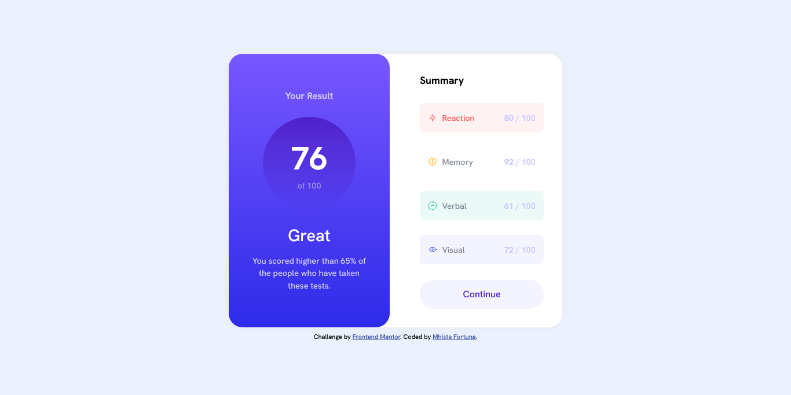
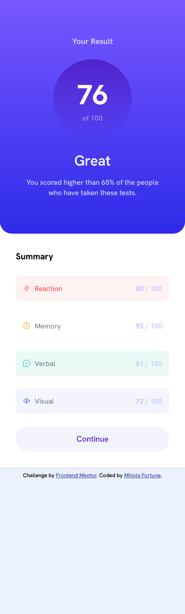

# Frontend Mentor - Results Summary Component

This is a solution to the [Results summary component challenge on Frontend Mentor](https://www.frontendmentor.io). Users can view a responsive results summary card that displays their score and a breakdown by category.

## Table of Contents

- [Overview](#overview)
- [The Challenge](#the-challenge)
- [Screenshot](#screenshot)
- [Links](#links)
- [Built With](#built-with)
- [Features](#features)
- [What I Learned](#what-i-learned)
- [How to Use](#how-to-use)
- [Author](#author)
- [Acknowledgments](#acknowledgments)

## Overview

This project is a responsive results summary component that displays a user's overall score and a breakdown of their performance in different categories. The layout adapts to both mobile and desktop screens and uses semantic HTML, CSS Grid, and Flexbox for structure and styling.

### The Challenge

Users should be able to:

- View the optimal layout for the interface depending on their device's screen size
- See hover and focus states for all interactive elements on the page

## Screenshot




## Links

- [Solution on Frontend Mentor](https://www.frontendmentor.io/solutions/responsive-results-summary-using-css-grid-and-flexbox-AY52dCLJrO)
- [Live Site](https://results-component-summary-frontend-mentor.vercel.app/) <!-- Add your live site URL here -->

## Built With

- Semantic HTML5 markup
- CSS custom properties
- Flexbox
- CSS Grid
- Mobile-first workflow
- Vanilla JavaScript (for dynamic summary rendering)

## Features

- Responsive layout for mobile and desktop
- Dynamic summary list generated from a JSON file
- Accessible and semantic HTML structure
- Custom styles for each summary category

### What I Learned

**Dynamic Data Rendering:**  
I learned how to fetch data from a local JSON file and dynamically render UI components using JavaScript, making the summary section flexible and easy to update.

**CSS Grid & Flexbox:**  
This project helped me practice positioning elements using both CSS Grid and Flexbox, and reinforced the benefits of a mobile-first workflow.

**Accessibility:**  
I improved my understanding of semantic HTML and accessibility best practices, such as using appropriate tags and alt attributes.

## How to Use

1. Clone this repository:
   ```sh
   git clone https://github.com/Mhista-Fortune/Results-Summary-Component
   ```
2. Open `index.html` in your browser to view the project.
3. To customize the summary data, edit the `data.json` file.

## Author

- Solution by [Egwu Ifeakarochukwu](https://github.com/Mhista-Fortune)
- [Frontend Mentor](https://www.frontendmentor.io/profile/Mhista-Fortune)

## Acknowledgments

- Challenge by [Frontend Mentor](https://www.frontendmentor.io?ref=challenge)